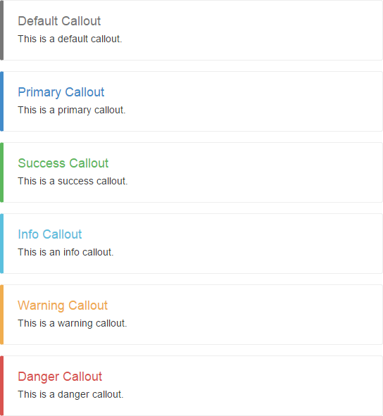

__Callouts is nicer message boxes for Twitter bootstrap.__

Use
---
    

        <h4>Default Callout</h4>
        
This is a default callout.

    

    

        <h4>Danger Callout</h4>
        
This is a danger callout.

    

    
### You can use this css classes:

- callout-default
- callout-primary
- callout-success
- callout-info
- callout-warning
- callout-danger

Visualization
-------------
 

Inspired by
-----------
- http://codepen.io/chrisdpratt/pen/IAymB/
- https://gist.github.com/matthiasg/6153853
